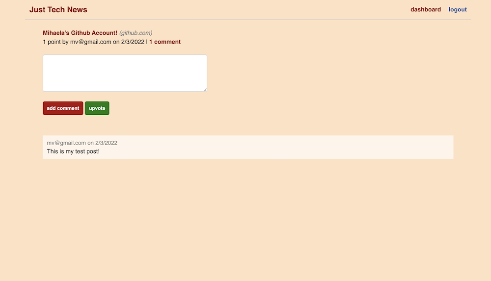

    <h1 align="center"> Tech News </h1>

## Description

  You can see the project repository <b>[here](https://github.com/mihaelavalac/just-tech-news).</b>   
  You can navigate to the deployed site <b>[here](https://tech-news-mv.herokuapp.com/).</b>

  
<i>The purpose of this application is to allow developers to create an account and share different tech articles and news with other developers. After creating an account, a user can create a post by adding the name and the link to the article. As well, a user can update or delete his/her posts or upvote and comment on others’ posts.</i>

## Table of Contents

- [Installation](#installation)
- [Features](#features)
- [Contributing](#contributing)
- [License](#license)
- [Questions](#questions)

## Installation

Follow the following instructions to install this project:   1. Download Nodejs to your computer.   2. Clone the project repo to your computer `git clone git@github.com:mihaelavalac/just-tech-news.git`   3. Navigate to the root of the project through your text editor.   4. Open terminal and run the following command `npm init` then, `npm install express` , `npm install bcrypt`, `npm install connect-session-sequelize`, `npm install dotenv`,  `npm install express-handlebars`,  `npm install express-session`,  `npm install mysql2`,  `npm install sequelize`,  `npm install jest`, `npm install path`   5. Run the `npm start` to start the Express server   6. Navigate to the `http://localhost:3001/`.   7. You should see the home page like bellow.      8. Click the `login` button to be redirected to the login page where you can create an account. (At least 4 characters required for password)      9. Log into your account to create/edit a new/existing post, leave comments, or vote.

 
 

## Features
GIVEN a tech-news application  
WHEN I open the tech-news app  
THEN I am presented with a landing page with diverse posts and navigation that link to login  
WHEN I click on the login link to these pages  
THEN I am presented with a page with login and sign-up forms  
WHEN I enter the email, username, and password in the sign-in form and or the email and password in the login form and submit it  
THEN I am redirected to a dashboard page to create a new post  
WHEN I enter a new post name and link in the form and submit it  
THEN the post is added to the home page  
WHEN I click the Edit post button under a specific post in the dashboard page  
THEN the edit post page opens with a form to edit post  
WHEN I enter the editions in the form and click Save post  
THEN the post is saved with editions  
WHEN click Delete post in the edit page  
THEN the post is saved deleted  
WHEN I am on the home page I see a list with all created posts  
WHEN I click the post name  
THEN the link of the article opens in a new tab  
WHEN I click the comments button under a post  
THEN the posting page opens with a form to leave a comment or up-vote the post  
WHEN I fill the form with a comment and click add comment  
THEN a comment is added under the post and the comments number increases  
WHEN I click the up-vote button on the post page  
THEN the number of points increases under the post. 

## Contributing

To contribute to the project just fork and install it on your computer, add the desired features/changes and push it back to the git. I will review the changes and merge them in the main branch.  

<b>Current Contributors:</b>  
👪 Mihaela Valac

## License

This application is covered by the <b>[GPL-2.0](https://opensource.org/licenses/GPL-2.0)</b> license.

## Questions

For questions, please contact me on:  

:octocat: Github: [mihaelavalac](https://github.com/mihaelavalac)  
✉️ Email: mihaelavalac@yahoo.com 

